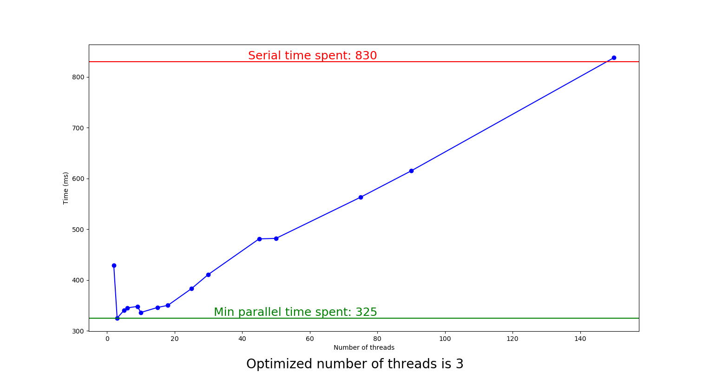

# Sepia Tone (Multi-threading)

Finding the efficient number of threads to apply sepia tone on a bitmap image.

I used the concept of multi-threading and segmented an input bitmap image to apply the sepia transform in parallel on each segment. Multi-threading (parallelization) results in faster outputs, compared to the serial case, provided that the number of threads is not extravagantly high. When the number of threads is excessilvely high, for each thread, the execution time becomes smaller than the joining time (a thread's duration of creation and termination).

## How to Run:

Consider the following image: $\textbf{(inputs/8.bmp)}$

Now run the bash-script file $\textbf{imageFiltering.sh}$: 

`
chmod +x imageFiltering.sh
`

`
./imageFiltering.sh
`

The output will be a chart whose x and y axes are number of threads and time, respectively:

As the chart indicates, the green line indicates the least execution time achieved by employing the optimized number of threads (Here, 3 threads). The red line shows the serial execution time. Pay attention that using 150 threads leads to a long execution time, even longer than the serial case. This is an example of how using excessive threads is inefficient.

In $\textbf{parallel/parallelFiltering}$ folder, the output transformed images created by employing different number of threads are included.

